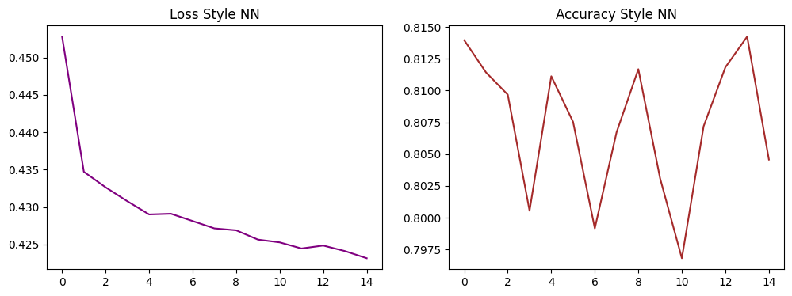

# <h1 align="center">❤️ HEART DISEASE CLASSIFICATION ❤️</h1>

<div align="center">
  

  <p><i>Sistem deteksi dini risiko kesehatan jantung berbasis Deep Learning & Transfer Learning.</i></p>
</div>

---

### 📝 Deskripsi Project
Project ini dikembangkan sebagai solusi cerdas dalam bidang teknologi kesehatan (*Health-Tech*) untuk mengklasifikasikan risiko penyakit jantung pada individu. Dengan memanfaatkan data tabular medis, sistem ini mampu memberikan prediksi probabilitas risiko yang dapat digunakan sebagai alat pendukung keputusan awal. Fokus utama riset ini adalah membandingkan performa arsitektur Neural Network murni dengan metode Transfer Learning pada data tabular guna menangani kompleksitas data medis.

---

### 📂 Dataset & Preprocessing
Dataset yang digunakan berisi **445,132 entri** dengan **40 kolom fitur** yang mencakup profil demografi, kondisi kesehatan kronis, dan kebiasaan gaya hidup.

**Tahapan Preprocessing:**
1. **Handling Missing Values:** Melakukan imputasi nilai median untuk data numerik dan mode untuk data kategorikal.
2. **Label Encoding:** Mengonversi data kategori menjadi format numerik yang dapat diproses oleh Neural Network.
3. **Feature Scaling:** Menggunakan *StandardScaler* untuk menyeragamkan rentang data numerik agar proses *gradient descent* lebih stabil.
4. **Handling Class Imbalance:** Mengimplementasikan **Class Weights (Balanced)** pada fungsi *loss* untuk memastikan model tetap sensitif terhadap kelas minoritas (positif serangan jantung).

---

### 🧠 Arsitektur Model
Terdapat tiga model berbeda yang diimplementasikan dalam proyek ini:

1. **Model 1: Multilayer Perceptron (MLP) - Base Model**
   Arsitektur *Feedforward Neural Network* yang dibangun dari awal dengan 3 layer linear, aktivasi ReLU, dan Dropout untuk mencegah overfitting.
2. **Model 2: TabNet - Pretrained (Transfer Learning 1)**
   Arsitektur *attention-based* yang dirancang khusus untuk data tabular. Menggunakan *Self-Supervised Pretraining* untuk mempelajari struktur data sebelum tahap *Fine-tuning*.
3. **Model 3: Style NN - Pretrained (Transfer Learning 2)**
   Model berbasis ekstraksi fitur mendalam (Feature Extractor) yang menggunakan *Pretrained Weights* pada layer awal untuk meningkatkan kemampuan pengenalan pola medis yang kompleks.

---

### 📊 Exploratory Data Analysis (EDA)
Analisis awal dilakukan untuk memahami distribusi data dan faktor risiko utama.

| Distribusi Target | Pengaruh BMI |
| :---: | :---: |
|  |  |
| *Visualisasi ketidakseimbangan data target.* | *Korelasi antara indeks massa tubuh dengan risiko.* |

---

### 📈 Grafik Performa (Loss & Accuracy)
Visualisasi proses pembelajaran setiap model selama tahap pelatihan dan validasi.

| Grafik Performa Model 1 | Grafik Performa Model 2 | Grafik Performa Model 3 |
| :---: | :---: | :---: |
|  |  |  |

---

### 📉 Perbandingan Hasil Evaluasi
Ringkasan performa akhir berdasarkan data uji (*test set*):

| Arsitektur Model | Akurasi Terbaik | Loss Terendah | Karakteristik Performa |
| :--- | :---: | :---: | :--- |
| **Model 1 (Base MLP)** | 80.91% | **0.4144** | Memiliki kemampuan minimisasi **Loss terbaik**, menunjukkan generalisasi yang sangat kuat. |
| **Model 2 (TabNet)** | **82.49%** | 0.4191 | Mencapai **Akurasi tertinggi** berkat mekanisme *attention* pada data tabular. |
| **Model 3 (Style NN)** | 81.43% | 0.4231 | Sangat stabil dalam rentang akurasi 81% dengan ekstraksi fitur mendalam. |

---

### 🧩 Confusion Matrix
Evaluasi detail untuk melihat presisi prediksi pada tiap kelas:

| Model 1: Base MLP | Model 2: TabNet | Model 3: Style NN |
| :---: | :---: | :---: |
|  |  |  |

---

### 🔍 Kesimpulan Ringkas
Berdasarkan eksperimen, **Model 2 (TabNet)** adalah yang paling unggul secara akurasi (82.49%), menjadikannya pilihan utama untuk deteksi presisi. Namun, **Model 1** menunjukkan nilai *Loss* yang paling kecil (0.4144), mengindikasikan tingkat kepastian prediksi yang tinggi. Penggunaan *Class Weights* terbukti krusial dalam menyeimbangkan hasil prediksi pada data medis yang tidak seimbang.

---

### 💻 Panduan Menjalankan Secara Lokal
Ikuti langkah berikut untuk menjalankan sistem website di perangkat Anda:

1. **Persiapan Folder:**
   Pastikan file model (`.pth`, `.zip`) dan scaler (`.pkl`) berada di dalam folder `src/models/`.
2. **Install Dependensi:**
   Gunakan PDM atau Pip untuk menginstal library:
   ```bash
   pip install streamlit pandas numpy torch pytorch-tabnet joblib scikit-learn
   ```
3. **Jalankan Aplikasi:**
   Eksekusi perintah berikut melalui terminal di root direktori proyek:
   ```bash
   streamlit run src/app.py
   ```

---

### 🛠️ Teknologi yang Digunakan
*   **Framework:** PyTorch, PyTorch-TabNet, Streamlit
*   **Library:** Pandas, NumPy, Scikit-Learn, Matplotlib, Seaborn, Joblib
*   **Tools:** Google Colab, VS Code, PDM

---

### 👤 Profil Pengembang

**Ahmad Naufal Luthfan Marzuqi**  
🆔 **NIM:** 202210370311072  
🎓 **Program Studi:** Teknik Informatika  
🏛️ **Universitas Muhammadiyah Malang**

---

### 🔗 Live Demo
Coba aplikasi deteksi jantung secara langsung di sini:  
🚀 **[Klasifikasi Risiko Penyakit Jantung App](https://klasifikasi-resiko-penyakit-jantung.streamlit.app/)**

---
<div align="center">
  <small>© 2025 Ahmad Naufal. Optimized for Health Tech.</small>
</div>
```