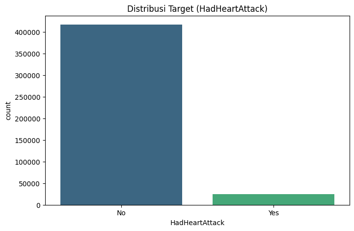
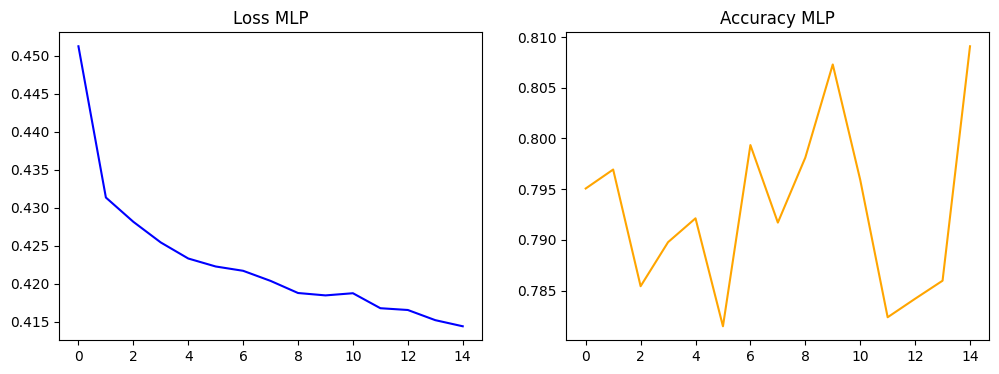
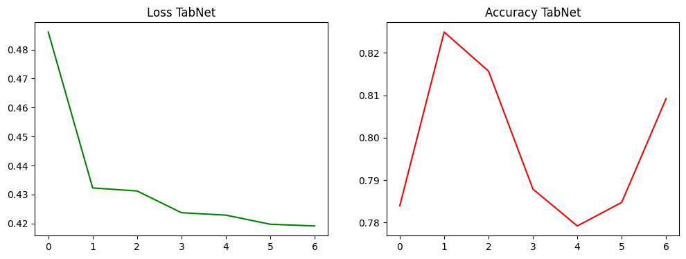
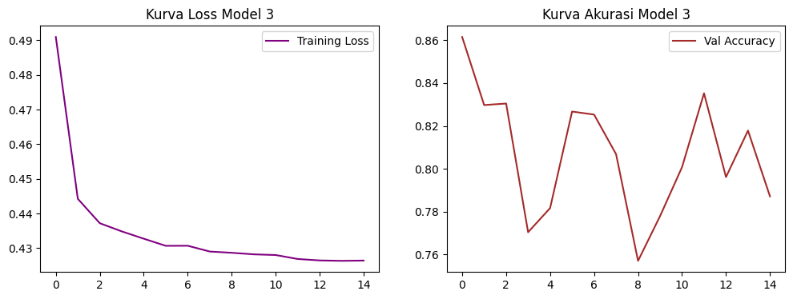
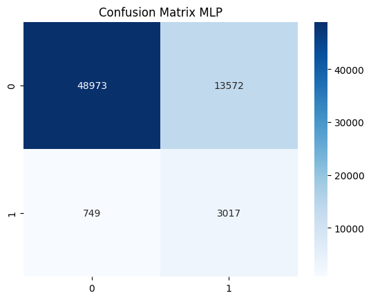
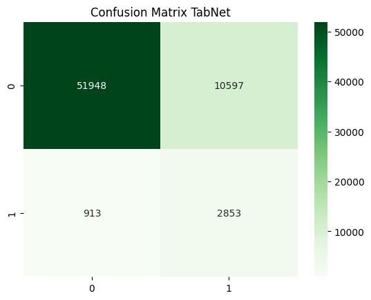
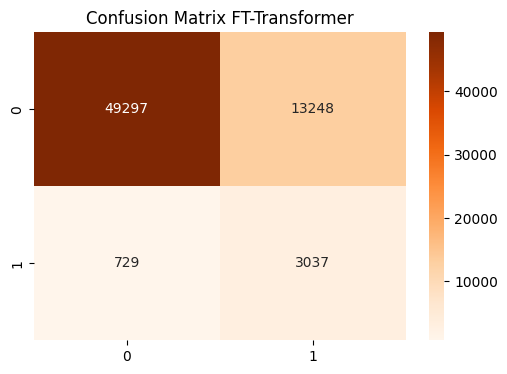

# <h1 align="center"> HEART DISEASE CLASSIFICATION </h1>

<div align="center">
  

  <p><i>Sistem deteksi dini risiko kesehatan jantung berbasis Deep Learning & Transfer Learning.</i></p>
</div>

---

### 📝 Deskripsi Project
Project ini dikembangkan sebagai solusi cerdas dalam bidang teknologi kesehatan (*Health-Tech*) untuk mengklasifikasikan risiko penyakit jantung pada individu. Dengan memanfaatkan data tabular medis, sistem ini mampu memberikan prediksi probabilitas risiko yang dapat digunakan sebagai alat pendukung keputusan awal. Fokus utama riset ini adalah membandingkan performa arsitektur Neural Network murni dengan metode Transfer Learning pada data tabular guna menangani kompleksitas data medis.

---

### 📂 Dataset & Preprocessing
Dataset yang digunakan berisi **445,132 entri** dengan **40 kolom fitur** yang mencakup profil demografi, kondisi kesehatan kronis, dan kebiasaan gaya hidup.

**Tahapan Preprocessing:**
1. **Handling Missing Values:** Melakukan imputasi nilai median untuk data numerik dan mode untuk data kategorikal.
2. **Label Encoding:** Mengonversi data kategori menjadi format numerik yang dapat diproses oleh Neural Network.
3. **Feature Scaling:** Menggunakan *StandardScaler* untuk menyeragamkan rentang data numerik agar proses *gradient descent* lebih stabil.
4. **Handling Class Imbalance:** Mengimplementasikan **Class Weights (Balanced)** pada fungsi *loss* untuk memastikan model tetap sensitif terhadap kelas minoritas (positif serangan jantung).

---

### 🧠 Arsitektur Model
Terdapat tiga model berbeda yang diimplementasikan dalam proyek ini:

1. **Model 1: Multilayer Perceptron (MLP) - Base Model**
   Arsitektur *Feedforward Neural Network* murni yang dibangun dari awal dengan optimasi *Class Weights* untuk menangani ketidakseimbangan data.
2. **Model 2: TabNet - Pretrained (Transfer Learning 1)**
   Arsitektur *attention-based* khusus data tabular yang menggunakan *Self-Supervised Pretraining* untuk menangkap pola fitur secara otomatis sebelum tahap klasifikasi.
3. **Model 3: FT-Transformer - Pretrained (Transfer Learning 2)**
   Model canggih berbasis *Feature Tokenizer Transformer*. Menggunakan mekanisme *Multi-head Attention* untuk mempelajari interaksi kompleks antar fitur medis secara paralel.

---

### 📊 Exploratory Data Analysis (EDA)
Analisis awal dilakukan untuk memahami distribusi data dan faktor risiko utama.

| Distribusi Target | Pengaruh BMI |
| :---: | :---: |
|  |  |
| *Visualisasi ketidakseimbangan data target.* | *Korelasi antara indeks massa tubuh dengan risiko.* |

---

### 📈 Grafik Performa (Loss & Accuracy)
Visualisasi proses pembelajaran setiap model selama tahap pelatihan dan validasi.

| Grafik Performa Model 1 | Grafik Performa Model 2 | Grafik Performa Model 3 |
| :---: | :---: | :---: |
|  |  |  |

---

### 📉 Perbandingan Hasil Evaluasi
Ringkasan performa akhir berdasarkan data uji (*test set*) menggunakan metrik klasifikasi lengkap:

| Arsitektur Model | Accuracy | Loss | Prec. | Rec. | F1 | Hasil Analisis |
| :--- | :---: | :---: | :---: | :---: | :---: | :--- |
| **Model 1 (Base MLP)** | 78% | **0.4139** | 0.18 | 0.80 | 0.30 | **Medical Stability Focus.** Menunjukkan kestabilan dalam deteksi dasar dengan nilai error paling rendah secara keseluruhan. |
| **Model 2 (TabNet)** | **83%** | 0.4191 | **0.21** | 0.76 | **0.33** | **General Precision Leader.** Unggul dalam akurasi dan presisi sistem, paling baik dalam meminimalisir kesalahan prediksi pada orang sehat. |
| **Model 3 (FT-Transformer)** | 79% | 0.4264 | 0.19 | **0.81** | 0.30 | **Medical Safety Champion.** Mencapai Recall tertinggi, sangat krusial dalam menjaring pasien sakit secara maksimal. |

---

### 🔍 Analisis Perbandingan & Kesimpulan
Setiap arsitektur model menunjukkan karakteristik performa yang berbeda sesuai dengan metode pendekatannya terhadap data medis:

*   **Model 1 (Base MLP):** Menitikberatkan pada aspek efisiensi dengan **Loss terendah (0.4139)**. Memberikan kepastian probabilitas yang stabil untuk screening awal pasien.
*   **Model 2 (TabNet):** Unggul sebagai model yang paling **Presisi dan Akurat (83% Acc)**. Berkat mekanisme *attention*, model ini paling cerdas dalam mengenali profil fitur tabular secara mendalam.
*   **Model 3 (FT-Transformer):** Menjadi model paling aman secara medis dengan **Recall tertinggi (0.81)**. Kemampuan *Attention Mechanism* pada arsitektur Transformer terbukti sangat efektif dalam mendeteksi pasien yang benar-benar memiliki riwayat serangan jantung (*True Positive*).

**Kesimpulan Akhir:**
Dalam konteks klasifikasi penyakit jantung, **Model 3 (FT-Transformer)** dianggap paling optimal untuk diagnosa awal karena sensitivitasnya yang sangat tinggi (Recall). Namun, **Model 2** tetap menjadi pilihan terbaik jika tujuannya adalah akurasi sistem secara menyeluruh.

---

### 🧩 Confusion Matrix
Evaluasi detail untuk melihat presisi prediksi pada tiap kelas:

| Model 1: Base MLP | Model 2: TabNet | Model 3: FT-Transformer |
| :---: | :---: | :---: |
|  |  |  |

---

### 💻 Panduan Menjalankan Secara Lokal
Ikuti langkah berikut untuk menjalankan sistem website di perangkat Anda:

1. **Persiapan Folder:**
   Pastikan file model (`.pth`, `.zip`) dan scaler (`.pkl`) berada di dalam folder `src/models/`.
2. **Install Dependensi:**
   Gunakan PDM atau Pip untuk menginstal library:
   ```bash
   pip install streamlit pandas numpy torch pytorch-tabnet joblib scikit-learn
   ```
3. **Jalankan Aplikasi:**
   Eksekusi perintah berikut melalui terminal di root direktori proyek:
   ```bash
   streamlit run src/app.py
   ```

---

### 🛠️ Teknologi yang Digunakan
*   **Framework:** PyTorch, PyTorch-TabNet, Streamlit
*   **Library:** Pandas, NumPy, Scikit-Learn, Matplotlib, Seaborn, Joblib
*   **Tools:** Google Colab, VS Code, PDM

---

### 👤 Profil Pengembang

**Ahmad Naufal Luthfan Marzuqi**  
🆔 **NIM:** 202210370311072  
🎓 **Program Studi:** Teknik Informatika  
🏛️ **Universitas Muhammadiyah Malang**

---

### 🔗 Live Demo
Coba aplikasi deteksi jantung secara langsung di sini:  
**[Klasifikasi Risiko Penyakit Jantung App](https://klasifikasi-resiko-penyakit-jantung.streamlit.app/)**

